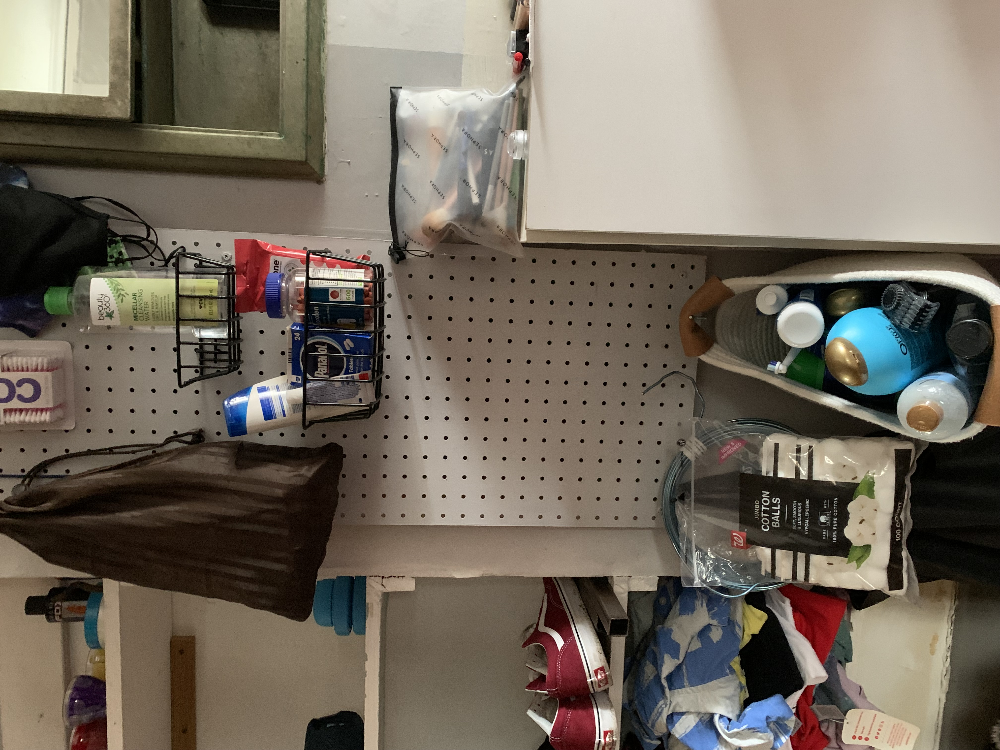
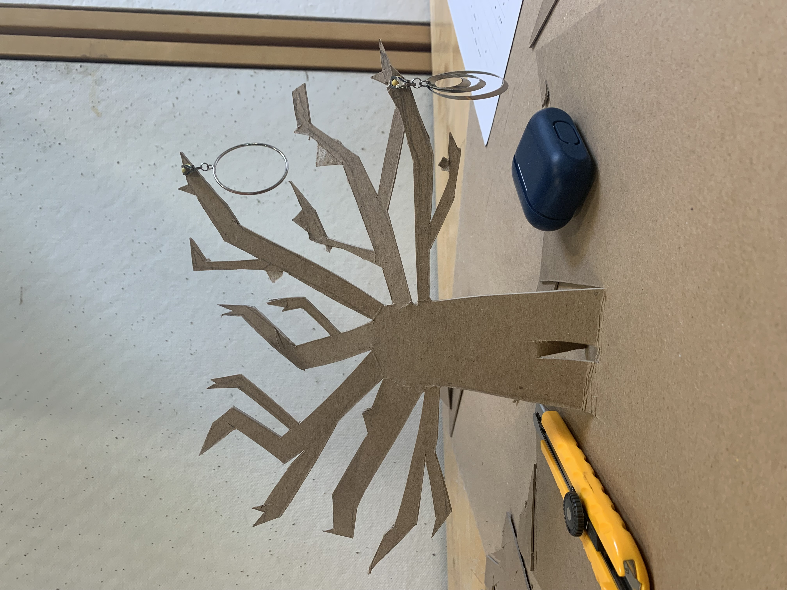
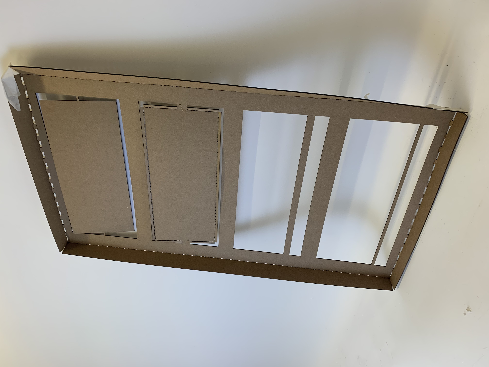
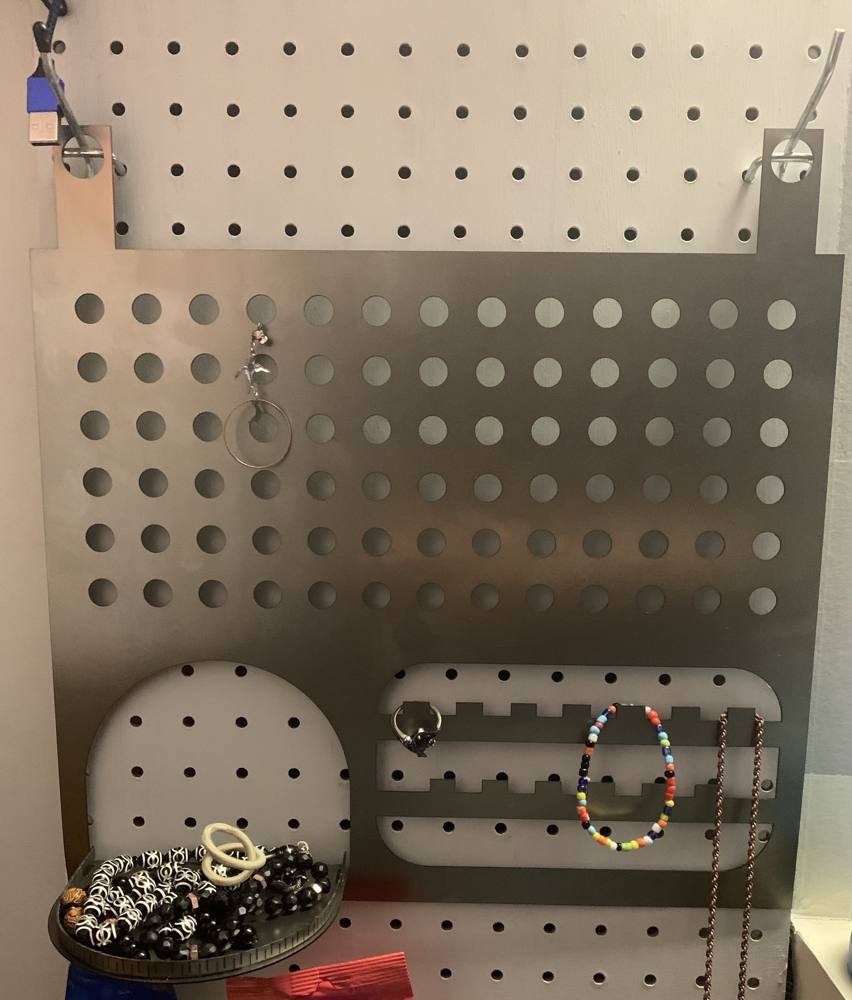
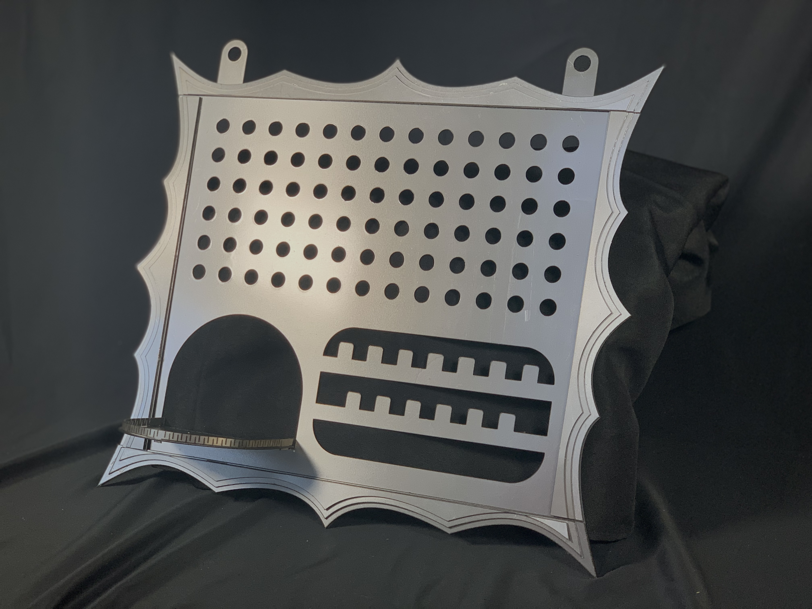

This jewelry holder was made with coldrolled steel plates that was lasercut. The metal was also perforated to allow ease of bending. 

## 1. Need
I had space on the pegboard next to my mirror, and I needed somewhere to store jewelry. 

## 2. Inspiration and Iterations
Idea 1:

Pros: looks cool
Cons: 
- very sharp, bad idea w metals
- not v convenient, limited space and easy to crowd
Idea 2:

[comment]: add pic of frame
So I ended up going with the simpler second idea and added flare by adding a pointy frame.

## 3. CAD and Manufacturing
The holder was designed on Rhino, using basic shapes and rectangular perferations where bends are.
Iteration 1 in use:

Works well, but looks boring. Adding the frame in the next iterations.

## 4. Final Result

In use:

