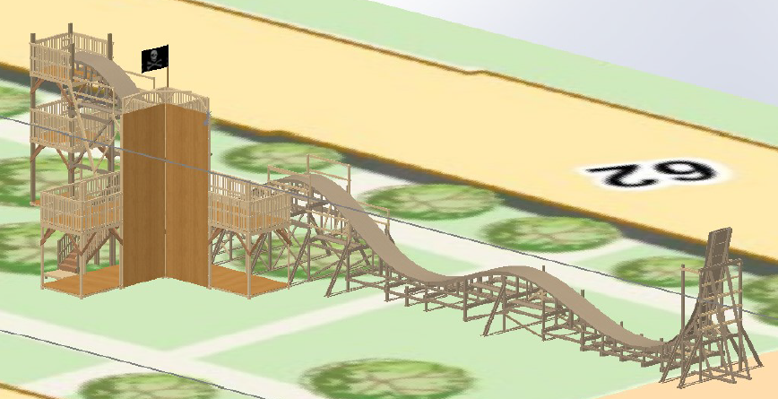

# Overview and role

- Led the building of a 3-story-high & 150-ft-long roller-coaster, fort, climbing wall, and small rides for MIT annual REX.
- Recruited students (8 build leads and 50 volunteers) to design and build.
- Co-managed finances ($30,000), managed building materials, and communicated with administrative bodies.

    

## What is MIT REX?
MIT Residential Exploration (REX) is an annual event ran by students of each undergraduate dorm to attract possible freshman tenants for the academic year. I personally lived in East Campus, where every year we traditioally build a large themepark attraction with other small rides and activities. Preparations for this one week event starts from February all the way to August where the event takes place.

Usually, four students (called REX chairs) take charge of organizing everything from recruitment of designers, raising money through sponsors, and oversight of the projects and materials. I was one of those four. Specficially, I sought after the build REX chair position, meaning my resposibilities included the oversight of all projects and materials and aquiring the needed permits from MIT and the City of Cambridge. 

# 1. Rides
## 1.1 Roller Coaster
## 1.2 Space Trainer

  

# 2. Roller Coaster Design Change

# 3. Logistical Challenges
## HRS, Insurance, and professional project feedback
As this is is a student-led project, there were many obstacles to acquiring permits for our rollercoaster and fort. 

# Lumber and Money Management
Overall budget for we aimed for was $30,000. This budget is decided through the Bill of Materials for the projects, small event budgets, and facilities for the volunteer builders. Through commmunication with the build leads, an appropriate amount of lumber and backup lumber is decided. I then sourced said lumber and our chosen provider based on that budget. 
# Final Party!
we got featured on mit news!
https://news.mit.edu/2022/featured-video-building-roller-coaster-0926
