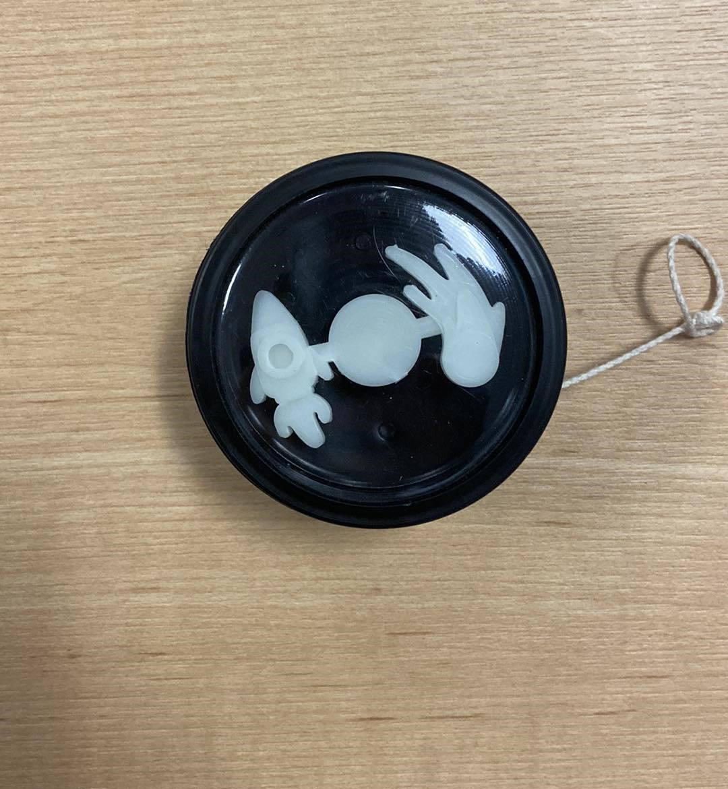
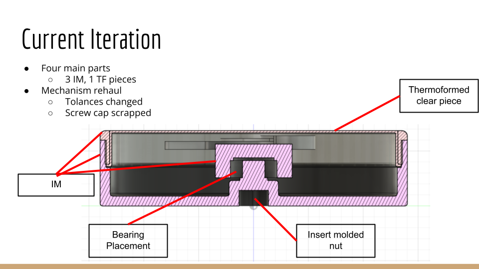
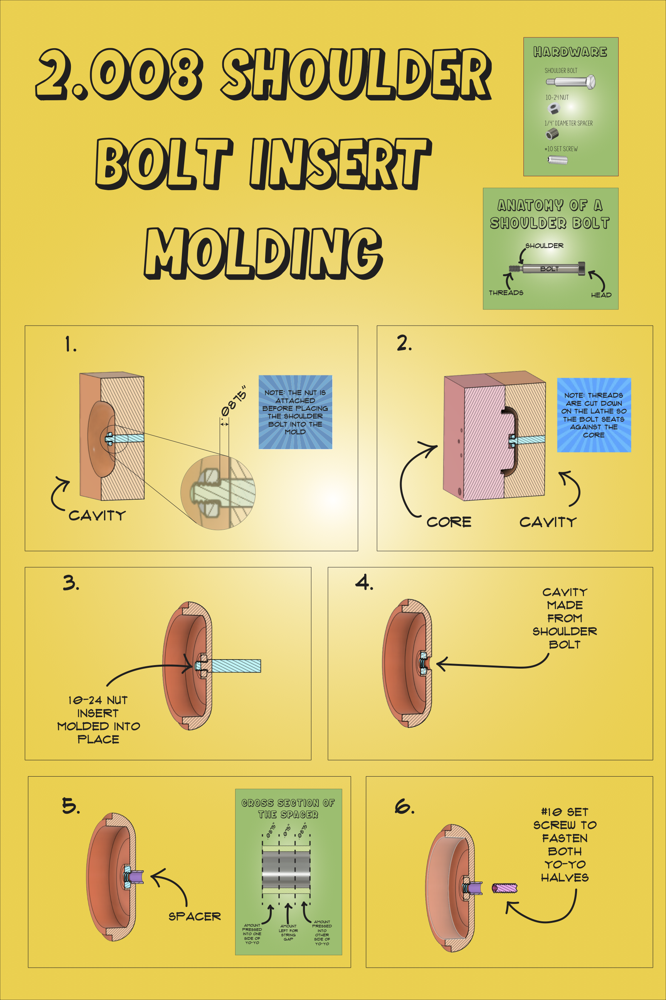
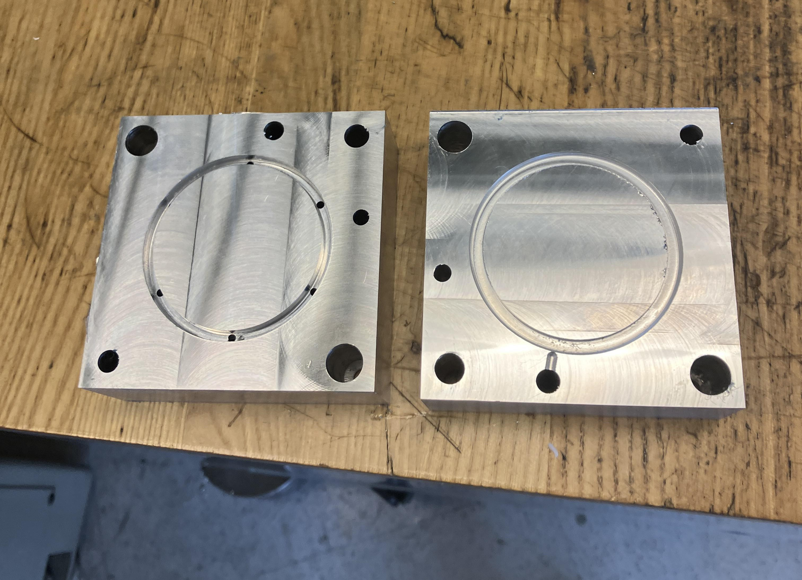
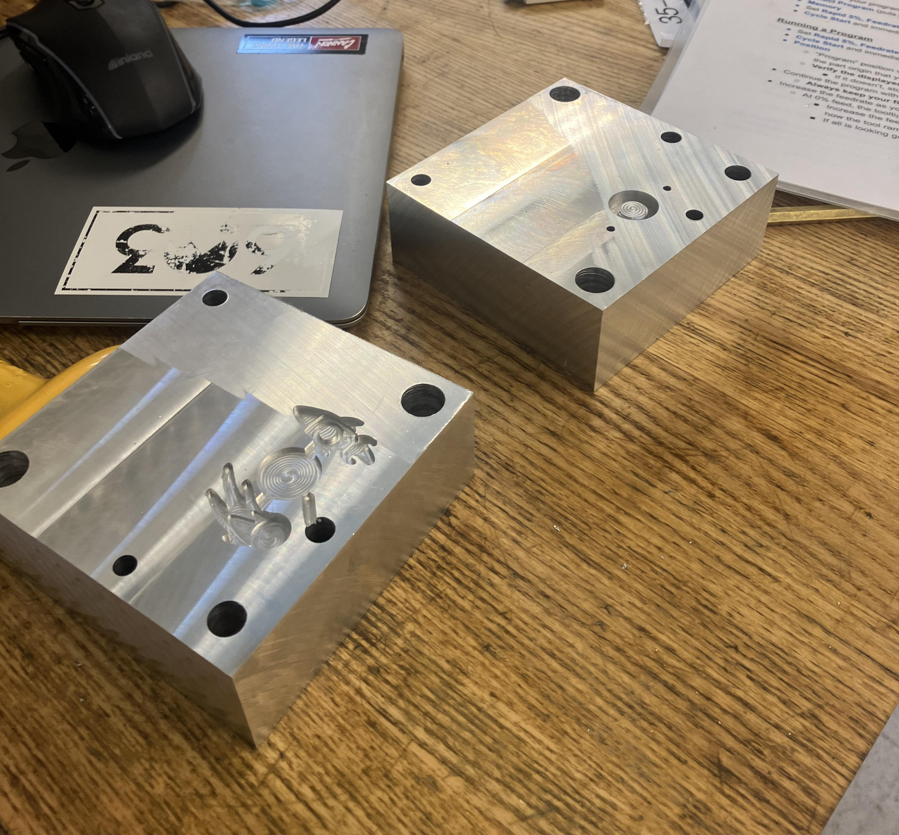
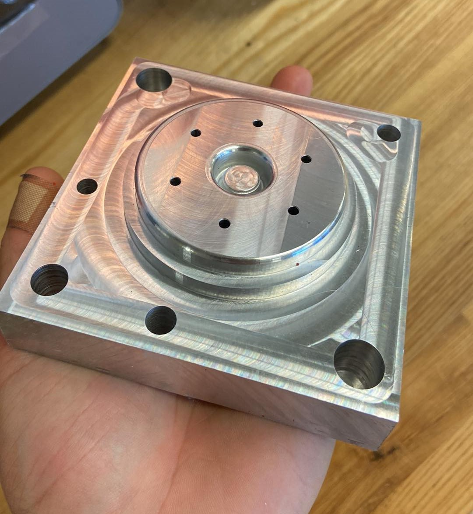

# Overview

    

  My team designed and manufactured 100 glow-in-the-dark yoyos for MIT 2.008: Design and Manufacturing II. Design was planned and reworked each yoyo batch. Final design included three injection molded pieces and one thermoformed piece press fit onto a bearing. Inspired by space and planetary systems, it was important to highlight glow in the dark and rotation aspects. As seen in the video, the middle centerpiece rotates indepedently of the whole yoyo. The yoyos were manufactured across the three months of the semester. My main contributions were the design and manufacturing of both the injeciton molding molds and the thermoforming molds. Moreover, manufacturing of all yoyo pieces was split between the *five* team members. As a result of this projects, several skills were gained:
- CNC Mill use
- Injection molding familiarity
- Thermoforming familiarity
- Mass manufacturing data analysis
- Project and timeline management

if video doesn't play, try this link [Yoyo Slow Motion Shot](https://youtube.com/shorts/p1FZ1mB4r0g) (https://youtube.com/shorts/p1FZ1mB4r0g):
 
 

<iframe width="315" height="560"
src="https://www.youtube.com/embed/p1FZ1mB4r0g"
title="Yoyo Slowmotion Shot"
frameborder="0"
allow="accelerometer; autoplay; clipboard-write; encrypted-media; gyroscope; picture-in-picture; web-share"
allowfullscreen></iframe>

# 1. Design
The molds were CNC'd on a mill using aluminum. The CAD for the design is shown below. After, the molds were designed and reworked three times to account for clearance and manufacturing variation. The design is inspired by planetary system rotation. As such, the main aspects have to do with *glow* and *rotation*. The design is intended to:
- Glow in the dark.
- The center piece rotates independantly of the yoyo.
For glow in the dark, we are using glow in the dark plastic pallets. Added to the plain plastic pallets with a 20% mass ratio, this makes the centerpiece glow in dim lighting.
To make the centerpiece rotate independently, it is press fit onto a bearing that is also press fit onto the bottom piece.

  

## 1.1. CAD
The overall design includes four pieces:
- Bottom piece
- Top piece
- Centerpiece
- Thermoformed cover

## 1.2 Shoulderbolt Design 
These are the particulars of how the shoulter bolt is insertion molded onto the bottom piece, allowing two yoyo halves to be joined together with the threading in the bolt.

  

# 2. Manufacturing
The main steps of manufacturing have two processes: Injection molding and thermoforming

## 2.1 Injection Molding
a HASS CNC Mill was used to mill out the molds from 4"x4"x1.5" aluminum blocks. The molds were then used in a BOY A22 injection molding machine for mass manufacturing.

  
  
  

## 2.2 Thermoforming
A simple mold was made that is similar to a hockey puck but with holes for creating vaccum suction. The mold was built with 3D printing SLA resin. 

## 2.3 Data Analysis

# 3. Final Design

