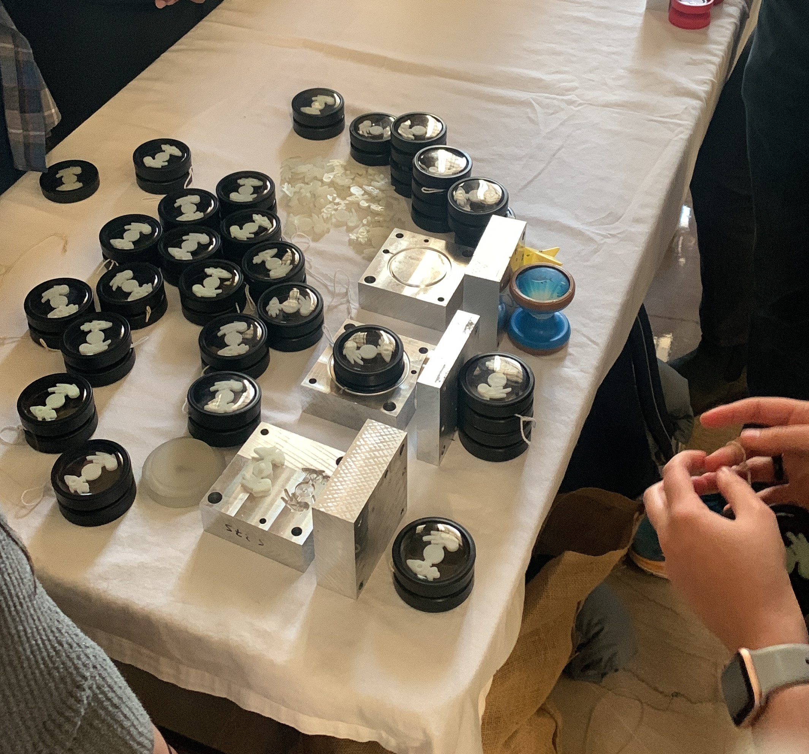

# Overview

  My team designed and manufactured 100 glow-in-the-dark yoyos. Design was planned and reworked each yoyo batch. Final design included three injection molded pieces and one thermoformed piece press fit onto a bearing. 
  

# 1: Design
The molds were CNC'd on a mill using aluminum. The CAD for the design is shown below. After, the molds were designed and reworked three times to account for clearance and manufacturing variation. The design is inspired by planetary system rotation. As such, the main aspects have to do with glow and rotation. The design is intended to:
- Glow in the dark.
- The center piece rotates independantly of the yoyo.

## 1.1 CAD
The CAD
## 1.2 Bearing Design
[comment]: add 2.008 bearing pic
## 1.3 Molds

  
  

# 2: Manufacturing
The main steps of manufacturing include 
## 2.1: HASS CNC Mill
for molds
## 2.2: 

## 3 Final Design:

  
  

100 yoyos were manufactured. This means 200 yoyo halves press fit into a bearing.

## 

  

  

